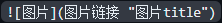
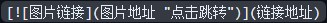

<!-- Updated on 20240412: 修改"数学"内容-->
<!-- build in 20240320 -->

# 目录
- [目录](#目录)
- [语法](#语法)
  - [标题](#标题)
    - [标题编号](#标题编号)
  - [段落](#段落)
  - [换行](#换行)
  - [强调](#强调)
  - [引用](#引用)
  - [列表](#列表)
    - [有序](#有序)
    - [无序](#无序)
    - [定义型列表(?)](#定义型列表)
  - [代码](#代码)
  - [分隔线](#分隔线)
  - [链接](#链接)
  - [图片](#图片)
  - [转义](#转义)
  - [内嵌HTML标签](#内嵌html标签)
    - [行级內联标签](#行级內联标签)
    - [区块标签](#区块标签)
  - [表格](#表格)
  - [脚注](#脚注)
  - [数学](#数学)
  - [注释](#注释)
- [VSCode for Markdown](#vscode-for-markdown)
- [其它/待厘清](#其它待厘清)

# 语法
**_POWER OF:_**  
[](https://markdown.com.cn/)
## 标题
\#号多少个代表几级标题

文字下一行加 =/\- 实现1、2级标题

### 标题编号
自定义标题ID：

`### My Great Heading {#custom-id}`

标题ID前加`#`链接到标题：

`[title](#heading-ids)`

[返回目录](#目录)
## 段落
使用空白行创建段落

无需空格、制表符

[返回目录](#目录)
## 换行
1. 行结尾+空格空格回车  
2. 行结尾+'\<br>'<br>
3. 行结尾+'\\'

ps. 第3点不是所有Md软件都兼容

[返回目录](#目录)
## 强调
1. 加粗：前后**双星号**、前后 __双下划线__
2. 斜体：前后*单星号*、前后 _下划线_
3. 删除线：前后~~波浪号~~
4. 粗斜体：前后***三星号***、前后 ___三下划线___

ps. 下划线的不推荐

[返回目录](#目录)
## 引用
> 在段落前加一个'\>'
> 
> 多段落块应用
>> 嵌套块引用
>- 可以包含其它Md格式元素，非所有生效(待实验)

[返回目录](#目录)
## 列表
### 有序
行前数字+英文句点，数字不必按数字顺序排列，但是列表应当以数字1起始，缩进嵌套
1. first
2. second
   1. first
   2. second
3. frist 
    > 在列表中添加另一种元素
    > 缩进4空格/制表符 + 其它元素
4. third
### 无序
行前'\-'、'\+'、'\*'，缩进嵌套
- +first
  - 1st
- second

+ -first
  + 1st
+ second

* *first
  * 1st
* second

### 定义型列表(?)
创建方法
:   开头":"+"Tab" / 空格

[返回目录](#目录)
## 代码
将代码包含在`` ` ``中\
代码中如果有\`，则包含在` `` `中
``d(`･∀･)b``

    每一行缩进
    创建代码块
~~~
围栏代码块
在块前后加~~~或```，无需缩进
在列表行行使用代码块会出现兼容问题
~~~

[返回目录](#目录)
## 分隔线
单独一行使用***

***

or ---

---

or ___

___

ps.分隔线前后最好加空白行，否则如"---"导致变成标题元素

[返回目录](#目录)
## 链接
`[链接名](链接地址 "链接title")`  
[Markdown链接语法](https://markdown.com.cn/basic-syntax/links.html "Test")

[返回目录](#目录)
## 图片
  
[](https://markdown.com.cn/basic-syntax/images.html)

[返回目录](#目录)
## 转义
\*在可转义字符前加`\`

[返回目录](#目录)
## 内嵌HTML标签
### 行级內联标签
如`<span>`、`<cite>`、`<del>`不受限制，可以在Markdown的段落、列表或是标题里任意使用。依照个人习惯，甚至可以不用Markdown格式，而采用HTML标签来格式化。例如：如果比较喜欢HTML的`<a>`或``标签，可以直接使用这些标签，而不用Markdown提供的链接或是图片语法。当你需要更改元素的属性时（例如为文本指定颜色或更改图像的宽度），使用HTML标签更方便些。

HTML行级內联标签和区块标签不同，在內联标签的范围内，Markdown的语法是可以解析的。
> *MD斜体* 和 <em>HTML斜体</em>
### 区块标签
区块元素──比如`<div>`、`<table>`、`<pre>`、`<p>`等标签，必须在前后加上空行，以便于内容区分。而且这些元素的开始与结尾标签，不可以用`tab`或是空白来缩进。Markdown会自动识别这区块元素，避免在区块标签前后加上没有必要的`<p>`标签。
~~~
(在VSCode使用<table>时有兼容问题)
<table>
    <tr>
       <td>Foo</td>
    </tr>
</tabel>
~~~
在HTML块级标签内不能使用Markdown语法。例如 `<p>italic and **bold**</p>`将不起作用。

[返回目录](#目录)
## 表格
使用`|`分割每列，再使用3以上`-`创建每列标题，以创建表格\
`:`在`---`左边代表居左，右边代表居右，默认居中
header|title
:---|---:
para|text
left|right

[返回目录](#目录)
## 脚注
创建脚注参考[^1]，有兼容问题

[^1]: 在`[]`内添加插入符号和标识符，不能包括空格或制表符

[返回目录](#目录)

## 数学
使用[KaTaX](https://katex.org/docs/supported '点击了解KaTeX支持哪些符号和函数') or [LaTaX](./UsageOfLaTeX.md#latex)渲染数学公式，插件`Markdown+Math`默认用`LaTaX`

- `$...$`中的数学表达式会在行内显示,  
  $f(x) = sin(x) + 12$
- `$$...$$`中的数学表达式会在块内显示  
$$
  \begin{pmatrix}
  1 & a_1 & a_1^2 & \cdots & a_1^n \\
  1 & a_2 & a_2^2 & \cdots & a_2^n \\
  \vdots & \vdots & \vdots & \ddots & \vdots \\
  1 & a_m & a_m^2 & \cdots & a_m^n \\
  \end{pmatrix}
$$
[返回目录](#目录)

## 注释
`<!-- 注释内容 -->`<!-- 看不见我 -->

# VSCode for Markdown
Markdown需要用渲染软件打开，这边使用VSCode[*点击跳转*](VSCodeForMarkdown.md)

# 其它/待厘清
- [ ] 数学相关要补充

[返回目录](#目录)