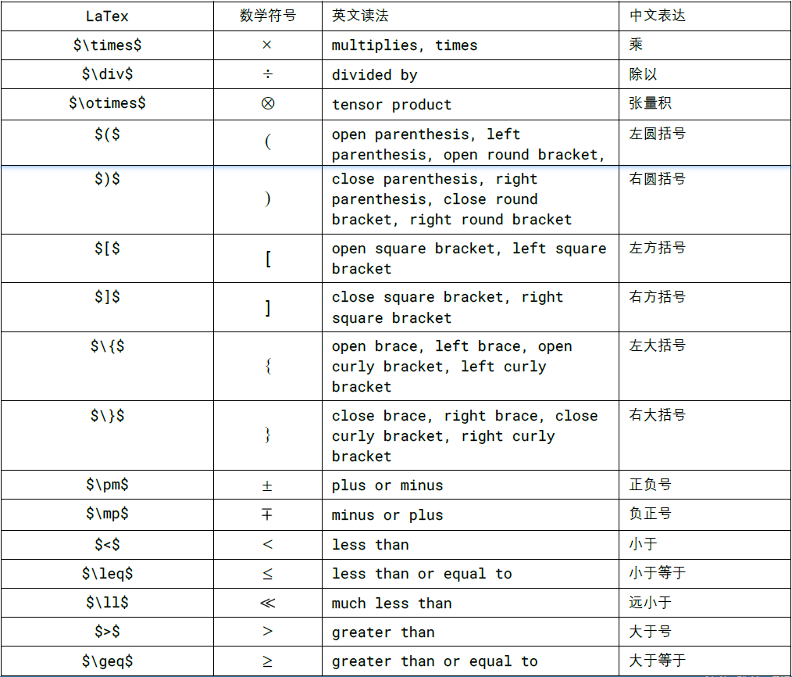

<!-- build in 20240412 -->
# LaTeX
[TOC]

## 数学中字符样式

## 数学中字母标记

## 希腊字母

## 常用符号

## 公式举例
公式|LaTeX
:---:|:---:
多项式|
$x^{2}-y^{2} = \left(x+y\right)\left(x-y\right)$|`$x^{2}-y^{2} = \left(x+y\right)\left(x-y\right)$`
$a_{n}x^{n}+a_{n-1}x^{n-1}+\dotsb + a_{2}x^{2} + a_{1}x + a_{0}$|`$a_{n}x^{n}+a_{n-1}x^{n-1}+\dotsb + a_{2}x^{2} + a_{1}x + a_{0}$`
$\sum_{k=0}^{n}a_{k}x^{k}$|`$\sum_{k=0}^{n}a_{k}x^{k}$`
$ ax^{2}+bx+c=0\ (a\neq 0) $|`$ ax^{2}+bx+c=0\ (a\neq 0) $`
根式|
${\sqrt[{n}]{a^{m}}}=(a^{m})^{1/n}=a^{m/n}=(a^{1/n})^{m}=({\sqrt[{n}]{a}})^{m}$|`${\sqrt[{n}]{a^{m}}}=(a^{m})^{1/n}=a^{m/n}=(a^{1/n})^{m}=({\sqrt[{n}]{a}})^{m}$`
$\left({\sqrt {1-x^{2}}}\right)^{2}$|`$\left({\sqrt {1-x^{2}}}\right)^{2}$`
分式|
$\frac {1}{x+1}+{\frac {1}{x-1}}={\frac {2x}{x^{2}-1}}$|`$\frac {1}{x+1}+{\frac {1}{x-1}}={\frac {2x}{x^{2}-1}}$`
$x_{1,2}={\frac {-b\pm {\sqrt {b^{2}-4ac}}}{2a}}$|`$x_{1,2}={\frac {-b\pm {\sqrt {b^{2}-4ac}}}{2a}}$`
函数|
$f(x)=ax^{2}+bx+c~~{\text{ with }}~~a,b,c\in\mathbb {R} ,\ a\neq 0$|`$f(x)=ax^{2}+bx+c~~{\text{ with }}~~a,b,c\in\mathbb {R} ,\ a\neq 0$`
$f(x_1, x_2) = x_1^2 + x_2^2 + 2x_1x_2$|`$f(x_1, x_2) = x_1^2 + x_2^2 + 2x_1x_2$`
$\log_{b}(xy)=\log_{b}x+\log_{b}y$|`$\log_{b}(xy)=\log_{b}x+\log_{b}y$`
$\ln(xy)=\ln x+\ln y{\text{ for }} x>0{\text{ and }} y>0$|`$\ln(xy)=\ln x+\ln y{\text{ for }} x>0{\text{ and }} y>0$`
$f(x)=a\exp \left(-{\frac {(xb)^{2}}{2c^{2}}}\right)$|`$f(x)=a\exp \left(-{\frac {(xb)^{2}}{2c^{2}}}\right)$`
三角恒等式|
$\sin ^{2}\theta +\cos ^{2}\theta =1$|`$\sin ^{2}\theta +\cos ^{2}\theta =1$`
$\sin 2\theta =2\sin \theta \cos \theta$|`$\sin 2\theta =2\sin \theta \cos \theta$`
$\sin(\alpha \pm \beta )=\sin \alpha \cos \beta \pm\cos \alpha \sin \beta$|`$\sin(\alpha \pm \beta )=\sin \alpha \cos \beta \pm\cos \alpha \sin \beta$`
$\tan(\alpha \pm \beta )=\frac {\tan \alpha \pm \tan\beta }{1\mp \tan \alpha \tan \beta }$|`$\tan(\alpha \pm \beta )=\frac {\tan \alpha \pm \tan\beta }{1\mp \tan \alpha \tan \beta }$`
微积分|
$\exp(x)=\sum _{k=0}^{\infty }{\frac{x^{k}}{k!}}=1+x+{\frac {x^{2}}{2}}+{\frac{x^{3}}{6}}+{\frac {x^{4}}{24}}+\cdots $|`$\exp(x)=\sum _{k=0}^{\infty }{\frac{x^{k}}{k!}}=1+x+{\frac {x^{2}}{2}}+{\frac{x^{3}}{6}}+{\frac {x^{4}}{24}}+\cdots $`
$ \left(\sum _{i=0}^{n}a_{i}\right)\left(\sum_{j=0}^{n}b_{j}\right)=\sum _{i=0}^{n}\sum_{j=0}^{n}a_{i}b_{j}$|`$ \left(\sum _{i=0}^{n}a_{i}\right)\left(\sum_{j=0}^{n}b_{j}\right)=\sum _{i=0}^{n}\sum_{j=0}^{n}a_{i}b_{j}$`
$\exp(x) =\lim _{n\to \infty }\left(1+{\frac{x}{n}}\right)^{n}$|`$\exp(x) =\lim _{n\to \infty }\left(1+{\frac{x}{n}}\right)^{n}$`
$\frac {\mathrm{d}}{\mathrm{d}x} \exp(f(x)) =f'(x)\exp(f(x))$|`$\frac {\mathrm{d}}{\mathrm{d}x} \exp(f(x)) =f'(x)\exp(f(x))$`
$\int_{a}^{b}f(x) \mathrm {d} x$|`$\int_{a}^{b}f(x) \mathrm {d} x$`
$\int _{-\infty }^{\infty }\exp(-x^{2})\mathrm{d}x={\sqrt {\mathrm{\pi} }}$|`$\int _{-\infty }^{\infty }\exp(-x^{2})\mathrm{d}x={\sqrt {\mathrm{\pi} }}$`
$\int _{-\infty }^{\infty }\int _{-\infty }^{\infty } \exp \left({-\left(x^{2}+y^{2}\right)} \right) {\mathrm{d}x}{\mathrm{d}y} = \pi$|`$\int _{-\infty }^{\infty }\int _{-\infty }^{\infty } \exp \left({-\left(x^{2}+y^{2}\right)} \right) {\mathrm{d}x}{\mathrm{d}y} = \pi$`
$\frac {\partial ^{2}f}{\partial x^{2}}=f''_{xx}=\partial _{xx}f=\partial _{x}^{2}f$|`$\frac {\partial ^{2}f}{\partialx^{2}}=f''_{xx}=\partial _{xx}f=\partial _{x}^{2}f$`
${\frac {\partial ^{2}f}{\partial y \partial x}}={\frac {\partial }{\partial y}}\left({\frac{\partial f}{\partial x}}\right)=f''_{xy}$|`${\frac {\partial ^{2}f}{\partial y \partialx}}={\frac {\partial }{\partial y}}\left({\frac{\partial f}{\partial x}}\right)=f''_{xy}$`
线性代数|
向量|
$\mathbf {a} = {\begin{bmatrix} a_{1} \\ a_{2} \\ a_{3} \end{bmatrix}} = [a_{1}\ a_{2}\ a_{3}]^{\operatorname {T} }$|`$\mathbf {a} = {\begin{bmatrix} a_{1} \\ a_{2} \\a_{3} \end{bmatrix}} = [a_{1}\ a_{2}\a_{3}]^{\operatorname {T} }$`
$\left\|\mathbf {a} \right\|=\sqrt{a_{1}^{2}+a_{2}^{2}+a_{3}^{2}}$|`$\left\|\mathbf {a} \right\|=\sqrt{a_{1}^{2}+a_{2}^{2}+a_{3}^{2}}$`
$\mathbf {a} \cdot \mathbf {b} = a_{1}b_{1} + a_{2}b_{2} + a_{3}b_{3}$|`$\mathbf {a} \cdot \mathbf {b} = a_{1}b_{1} + a_{2}b_{2} + a_{3}b_{3}$`
$\mathbf {a} \cdot \mathbf {b} =\left\|\mathbf {a}\right\|\left\|\mathbf {b} \right\|\cos \theta $ |`$\mathbf {a} \cdot \mathbf {b} =\left\|\mathbf {a}\right\|\left\|\mathbf {b} \right\|\cos \theta $`
$\|\mathbf {x} \|_{p}=\left(\sum_{i=1}^{n}\left\|x_{i}\right\|^{p}\right)^{1/p}$ | `$\|\mathbf {x} \|_{p}=\left(\sum_{i=1}^{n}\left|x_{i}\right|^{p}\right)^{1/p}$`
矩阵|
$\mathbf {A} = {\begin{bmatrix} 1 & 2\\ 3& 4 \\ 5 & 6 \end{bmatrix}}$|`$\mathbf {A} = {\begin{bmatrix} 1 & 2\\ 3& 4 \\ 5 & 6 \end{bmatrix}}$`
$\mathbf {A}={\begin{bmatrix}a_{11}&a_{12}&\cdots&a_{1n}\\a_{21}&a_{22}&\cdots&a_{2n}\\\vdots &\vdots &\ddots &\vdots\\a_{m1}&a_{m2}&\cdots&a_{mn}\end{bmatrix}}$|`$\mathbf {A}={\begin{bmatrix}a_{11}&a_{12}&\cdots&a_{1n}\\a_{21}&a_{22}&\cdots&a_{2n}\\\vdots &\vdots &\ddots &\vdots\\a_{m1}&a_{m2}&\cdots&a_{mn}\end{bmatrix}}$`
$\left(\mathbf {A} +\mathbf {B}\right)^{\operatorname {T} }=\mathbf {A}^{\operatorname {T} }+\mathbf {B}^{\operatorname {T} }$|`$\left(\mathbf {A} +\mathbf {B}\right)^{\operatorname {T} }=\mathbf {A}^{\operatorname {T} }+\mathbf {B}^{\operatorname {T} }$`
$\left(\mathbf {AB}\right)^{\operatorname {T} }=\mathbf {B}^{\operatorname {T} }\mathbf {A}^{\operatorname {T} }$|`$\left(\mathbf {AB}\right)^{\operatorname {T} }=\mathbf {B}^{\operatorname {T} }\mathbf {A}^{\operatorname {T} }$`
$ \left(\mathbf {A} ^{\operatorname{T} }\right)^{-1}=\left(\mathbf {A} ^{-1}\right)^{\operatorname {T} }$|`$ \left(\mathbf {A} ^{\operatorname{T} }\right)^{-1}=\left(\mathbf {A} ^{-1}\right)^{\operatorname {T} }$`
$\mathbf {u} \otimes \mathbf {v} =\mathbf {u} \mathbf {v} ^ {\operatorname{T}} = {\begin{bmatrix}u_{1} \\ u_{2} \\u_{3} \\ u_{4} \end{bmatrix}}{\begin{bmatrix} v_{1}&v_{2}&v_{3}\end{bmatrix}} = {\begin{bmatrix}u_{1}v_{1} & u_{1}v_{2} & u_{1}v_{3} \\u_{2}v_{1} & u_{2}v_{2} & u_{2}v_{3} \\u_{3}v_{1} & u_{3}v_{2} & u_{3}v_{3} \\u_{4}v_{1} & u_{4}v_{2} & u_{4}v_{3}\end{bmatrix}}$|`$\mathbf {u} \otimes \mathbf {v} =\mathbf {u} \mathbf {v} ^ {\operatorname{T}} = {\begin{bmatrix}u_{1} \\ u_{2} \\u_{3} \\ u_{4} \end{bmatrix}}{\begin{bmatrix} v_{1}&v_{2}&v_{3}\end{bmatrix}} = {\begin{bmatrix}u_{1}v_{1} & u_{1}v_{2} & u_{1}v_{3} \\u_{2}v_{1} & u_{2}v_{2} & u_{2}v_{3} \\u_{3}v_{1} & u_{3}v_{2} & u_{3}v_{3} \\u_{4}v_{1} & u_{4}v_{2} & u_{4}v_{3}\end{bmatrix}}$`
$\det {\begin{bmatrix} a & b \\ c & d\end{bmatrix}} = ad-bc$|`$\det {\begin{bmatrix} a & b \\ c & d\end{bmatrix}} = ad-bc$`
概率统计|
$\Pr(A\vert B)={\frac {\Pr(B\vert A)\Pr(A)}{\Pr(B)}}$|`$\Pr(A\vert B)={\frac {\Pr(B\vertA)\Pr(A)}{\Pr(B)}}$`
$ f_{X\vert Y=y}(x)={\frac{f_{X,Y}(x,y)}{f_{Y}(y)}}$|`$ f_{X\vert Y=y}(x)={\frac{f_{X,Y}(x,y)}{f_{Y}(y)}}$`
$\operatorname {var} (X) = \operatorname {E}\left[X^{2}\right]-\operatorname {E} [X]^{2}$|`$\operatorname {var} (X) = \operatorname {E}\left[X^{2}\right]-\operatorname {E} [X]^{2}$`
$\operatorname {var} (aX+bY)=a^{2}\operatorname{var} (X) + b^{2}\operatorname {var} (Y) + 2ab\operatorname {cov} (X,Y)$|`$\operatorname {var} (aX+bY)=a^{2}\operatorname{var} (X) + b^{2}\operatorname {var} (Y) + 2ab\operatorname {cov} (X,Y)$`
$\operatorname {E} [X]=\int _{-\infty }^{\infty }xf_{X}(x) \operatorname {d}x$|`$\operatorname {E} [X]=\int _{-\infty }^{\infty }xf_{X}(x) \operatorname {d}x$`
$ X\sim N(\mu ,\sigma ^{2})$|`$ X\sim N(\mu ,\sigma ^{2})$`
$\frac {\exp \left(-{\frac {1}{2}}\left({\mathbf {x} }-{\boldsymbol {\mu }}\right)^{\mathrm {T} }{\boldsymbol {\Sigma }}^{-1}\left({\mathbf {x} }- {\boldsymbol {\mu }}\right)\right)}{\sqrt{(2\pi )^{k}\|{\boldsymbol {\Sigma }}\|}}$ |`$\frac {\exp \left(-{\frac{1}{2}}\left({\mathbf {x} }-{\boldsymbol{\mu }}\right)^{\mathrm {T} }{\boldsymbol{\Sigma }}^{-1}\left({\mathbf {x} }-{\boldsymbol {\mu }}\right)\right)}{\sqrt{(2\pi )^{k}|{\boldsymbol {\Sigma }}|}}$`
