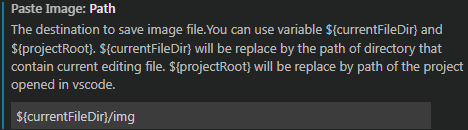
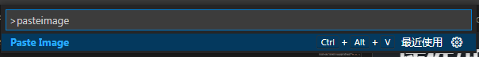

<!-- build in 20240320 -->
[TOC]
# VS Code
[VSCode Markdown官方使用说明](https://code.visualstudio.com/Docs/languages/markdown "点击跳转")

该文件使用插件`Markdown Preview Enhanced`渲染

更多更详细[点击](https://zhuanlan.zhihu.com/p/366596107)

## 整行注释快捷键
`Ctrl + /`

## 遍历和跳转
当前文件
: `Ctrl+Shift+O`

文件夹/workspace
: `Ctrl+T`

## 链接文件外标题(header)
`[link text](##headerID)`
>`##`能列出workspace下.md的header


## 链接拖拽生成


## 快速选择(?)
Expend
: `Shift+Alt+Right`

Shrink
: `Shift+Alt+Left`

## 任务列表
- [x] write the press release
- [ ] update the website
- [x] contact the media

# 插件/扩展
# Paste Image
**将剪贴板中的图片保存至指定路径并在文件中生成图片链接**
[Paste Image官方使用说明](https://marketplace.visualstudio.com/items?itemName=mushan.vscode-paste-image)

1. 设置保存路径，默认当前工作路径，注意是`Path`不是`BasePath`  

2. 复制图片后，`Ctrl+Shift+P`，输入`paste image+回车`(或者自己设置快捷键)，则在光标处插入图片  


## Markdown All in One
[MarkDown All in One官方使用说明](https://marketplace.visualstudio.com/items?itemName=yzhang.markdown-all-in-one)

### 快捷键
快捷键|功能
---|---
`Ctrl+B`|选中加粗
`Ctrl+I`|选中斜体
`Alt+S`|选中删除线
`Ctrl+Shift+]`|选中标题升级
`Ctrl+Shift+[`|选中标题降级
`Ctrl+M`|创建math
`Alt+C`|选中任务列表标记
`Ctrl+Shift+V`|预览
`Ctrl+K V`|侧边预览

### 快捷目录
cmd|功能
---|---
`Create Table of Contents`|创建目录([附录A](#a))
`section`|标题目录创建/删除编号

cmd创建目录:`Create Table of Contents`\
在标题后添加`<!-- omit in toc -->`，目录将忽略该标题

### 生成HTML
cmd:`Print current document to HTML`

## Markdown Preview Enhanced(推荐)
[Markdown Preview Enhanced官方使用说明](https://shd101wyy.github.io/markdown-preview-enhanced/#/)

### MPE+CMD:
cmd|功能
:---|:---
`Zen Mode`|禅(无干扰)模式
`Create Toc`|生成目录([附录B](#b))
`Toggle Scrolll Sync`|预览同步滑动开关
`Sync Source`|滑动预览到编辑器中的位置
`Toggle Live Update`|预览实时更新开关，关闭时保存才更新
`Toggle Break On Single Newline`|单回车[换行](#换行)开关
`Insert Table`|插入MD表格
`Insert Page Break`|插入断页符
`Image Helper`|图片助手
`Run Code Chunk`|运行代码块
`Run All Code Chunk`|运行所有代码块

### 快捷键
快捷键|功能
---|---
`Ctrl+Shift+M`|预览
`Ctrl+Shift+S`|滑动同步
`Shift+Enter`|运行代码块
`Ctrl+Shift+Enter`|运行所有代码块
`Esc`|开关边栏Toc

### 表格合并
在插件设置中打开`enableExtendedTableSyntax`
表格合并||
---|---
|>|1
2|3
^|4

### Emoji&Font-Awesome
:smile:
:fa-car:

### 上标下标
`30^th^`→30^th^
`H~2~O`→H~2~O

### 缩略
*[缩略信息]: 在*[]内添加详细信息
鼠标悬停虚线， 缩略信息 会显示，左右要空格

### 标记
文本左右==双等号==

### 数学
Code Chunk支持` ```math + 数学表达式 + ``` `渲染表达式
```math
H(D_2) = -\left(\frac{2}{4}\log_2 \frac{2}{4} + \frac{2}{4}\log_2 \frac{2}{4}\right) = 1
```

### Toc设置
- 忽略的标题后加{ignore = true}
- **orderedList**是否使用有序列表
- **depthFrom**标题深度[1-6]
- **ignoreLink**如果为`true`，标题不会超链接
- 在markdown文件中输入`[TOC]`创建Toc，只会在预览中渲染显示，不会修改markdown文件
  - 通过编写front-matter设置[TOC]及边栏TOC(实验失败)  
  ```
  ---
  toc:
    depth_from: 1
    depth_to: 6
    ordered: false
  ---
  ```

### 导入外部文件
仅仅`@import "你的文件"`，也支持`<!-- @import "your_file" -->`

@import "img/import-other.gif"

#### 支持文件类型
- `jpeg(.jpg), .gif, .png, .apng, .svg, .bmp`文件将会直接被当作 markdown 图片被引用。
- `csv`文件将会被转换成 markdown 表格。
- `.mermaid`将会被 mermaid 渲染。
- `.dot`文件将会被 viz.js (graphviz) 渲染。
- `.plantuml(.puml)`文件将会被 PlantUML 渲染。
- `.html`将会直接被引入。
- `.js`将会被引用为`<script src="你的 js 文件"></script>`。
- `.less`和`.css`将会被引用为 style。目前`less`只支持本地文件。`.css`文件将会被引用为`<link rel="stylesheet" href="你的 css 文件">`。
- `.pdf`文件将会被`pdf2svg`转换为`svg`然后被引用。
- `markdown`将会被分析处理然后被引用。
- 其他所有的文件都将被视为代码块。

#### 导入文件设置
- 图片  
  ```
  @import "test.png" {width="300px" height="200px" title="图片的标题" alt="我的 alt"}
  ```
- 离线文件
  ```
  @import "https://raw.githubusercontent.com/shd101wyy/markdown-preview-enhanced/master/LICENSE.md"
  ```
- PDF，需要先安装好`pdf2svg`
  ```
  @import "test.pdf" {page_no=1 page_begin=2 page_end=4}

  * page_no 显示第 nth 页。例如 {page_no=1} 将会只显示 PDF 文件的第 1 页。
  * page_begin, page_end 包含的。例如 {page_begin=2 page_end=4} 将会显示第 2，3，4 页。
  ```
- 强制渲染为代码块
  ```
  @import "test.puml" {code_block=true class="line-numbers"}
  @import "test.py" {class="line-numbers"}
  ```
- As代码块
  ```
  @import "test.json" {as="vega-lite"}
  ```
- 导入特定行数
  ```
  @import "test.md" {line_begin=2}
  @import "test.md" {line_begin=2 line_end=10}
  @import "test.md" {line_end=-4}
  ```
- 引用文件作为Code Chunk
  ```
  @import "test.py" {cmd="python3"}
  ```

### Code Chunk
渲染各种代码的运行结果，写的时候使用不了，还没摸索清楚，[点击查看](https://shd101wyy.github.io/markdown-preview-enhanced/#/zh-cn/code-chunk '点击查看')

```python {.line-numbers .highlight=1}
print('hello world!')
print('my name is John.')

print('This code chunk feature from MPE.')
print('Wait for verification.')
```

# 附录
## A
- [VS Code](#vs-code)
  - [整行注释快捷键](#整行注释快捷键)
  - [遍历和跳转](#遍历和跳转)
  - [链接文件外标题(header)](#链接文件外标题header)
  - [链接拖拽生成](#链接拖拽生成)
  - [快速选择(?)](#快速选择)
  - [任务列表](#任务列表)
- [插件/扩展](#插件扩展)
- [Paste Image](#paste-image)
  - [Markdown All in One](#markdown-all-in-one)
    - [快捷键](#快捷键)
    - [快捷目录](#快捷目录)
    - [生成HTML](#生成html)
  - [Markdown Preview Enhanced(推荐)](#markdown-preview-enhanced推荐)
    - [MPE+CMD:](#mpecmd)
    - [快捷键](#快捷键-1)
    - [表格合并](#表格合并)
    - [Emoji\&Font-Awesome](#emojifont-awesome)
    - [上标下标](#上标下标)
    - [缩略](#缩略)
    - [标记](#标记)
    - [数学](#数学)
    - [Toc设置](#toc设置)
    - [导入外部文件](#导入外部文件)
      - [支持文件类型](#支持文件类型)
      - [导入文件设置](#导入文件设置)
    - [Code Chunk](#code-chunk)
- [附录](#附录)
  - [A](#a)
  - [B](#b)

## B
<!-- code_chunk_output -->
- [VS Code](#vs-code)
  - [整行注释快捷键](#整行注释快捷键)
  - [遍历和跳转](#遍历和跳转)
  - [链接文件外标题(header)](#链接文件外标题header)
  - [链接拖拽生成](#链接拖拽生成)
  - [快速选择(?)](#快速选择)
  - [任务列表](#任务列表)
- [插件/扩展](#插件扩展)
- [Paste Image](#paste-image)
  - [Markdown All in One](#markdown-all-in-one)
    - [快捷键](#快捷键)
    - [快捷目录](#快捷目录)
    - [生成HTML](#生成html)
  - [Markdown Preview Enhanced(推荐)](#markdown-preview-enhanced推荐)
    - [MPE+CMD:](#mpecmd)
    - [快捷键](#快捷键-1)
    - [表格合并](#表格合并)
    - [Emoji\&Font-Awesome](#emojifont-awesome)
    - [上标下标](#上标下标)
    - [缩略](#缩略)
    - [标记](#标记)
    - [数学](#数学)
    - [Toc设置](#toc设置)
    - [导入外部文件](#导入外部文件)
      - [支持文件类型](#支持文件类型)
      - [导入文件设置](#导入文件设置)
    - [Code Chunk](#code-chunk)
- [附录](#附录)
  - [A](#a)
  - [B](#b)

<!-- /code_chunk_output -->